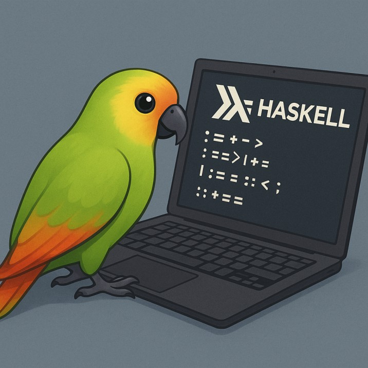

# 🦜️🔗LangChain Haskell

⚡ Building applications with LLMs through composability in Haskell! ⚡

<div style="text-align: center;">

</div>

## Introduction

LangChain Haskell is a robust port of the original [LangChain](https://github.com/langchain-ai/langchain) library, bringing its powerful natural language processing capabilities to the Haskell ecosystem. This library enables developers to build applications powered by large language models (LLMs) with ease and flexibility.

### [Documentation](https://tusharad.github.io/langchain-hs/docs/)
### [Hackage API reference](https://hackage.haskell.org/package/langchain-hs)


## Features

- **LLM Integration**: Seamlessly interact with various language models, including OpenAI's GPT series and others.
- **Prompt Templates**: Create and manage dynamic prompts for different tasks.
- **Memory Management**: Implement conversational memory to maintain context across interactions.
- **Agents and Tools**: Develop agents that can utilize tools to perform complex tasks.
- **Document Loaders**: Load and process documents from various sources for use in your applications.
- **Text Splitter**: Components for splitting text into smaller chunks for processing.
- **Output Parser**: Components for parsing and processing the output of LLMs.
- **VectorStore and Retriever**: Mechanism for storing and retrieving document embeddings.
   * Includes support for Faiss, a library for efficient similarity search. This integration is available through the separate [`faiss-hs`](https://github.com/tusharad/faiss-hs) repository.
- **Embeddings**: Components for generating vector representations of text.

## Current Supported Providers

  - Ollama
  - OpenAI
  - Huggingface
  - OpenAI compatible APIs (LMStudio, OpenRouter, Llama-cpp, Deepseek)
  - More to come...

## Installation

To use LangChain Haskell in your project, add it to your package dependencies. 
If you're using Stack, include it in your `package.yaml`:

```yaml
dependencies:
  - base < 5
  - langchain-hs
```
Then, run the build command for your respective build tool to fetch and compile the dependency.

## Quickstart

Here's a simple example demonstrating how to use LangChain Haskell to interact with an LLM:

```haskell
{-# LANGUAGE OverloadedStrings #-}
module Main (main) where

import Langchain.LLM.Ollama
import Langchain.LLM.Core
import Langchain.PromptTemplate
import Langchain.Callback
import qualified Data.Map.Strict as Map
import qualified Data.Text as T

main :: IO ()
main = do 
  let ollamaLLM = Ollama "llama3.2" [stdOutCallback]
      prompt = PromptTemplate "Translate the following English text to French: {text}"
      input = Map.fromList [("text", "Hello, how are you?")]
      
  case renderPrompt prompt input of
    Left e -> putStrLn $ "Error: " ++ e
    Right renderedPrompt -> do
      eRes <- generate ollamaLLM renderedPrompt Nothing
      case eRes of
        Left err -> putStrLn $ "Error: " ++ err
        Right response -> putStrLn $ "Translation: " ++ (T.unpack response)
```

## Contributing

Contributions are welcome! If you'd like to contribute, please fork the repository and submit a pull request. 
For major changes, please open an issue first to discuss what you'd like to change.

## License

This project is licensed under the MIT License. See the [LICENSE](LICENSE) file for details.

## Acknowledgements

This project is inspired by and builds upon the original [LangChain](https://github.com/langchain-ai/langchain) library and its various ports in other programming languages. 
Special thanks to the developers of those projects for their foundational work.
